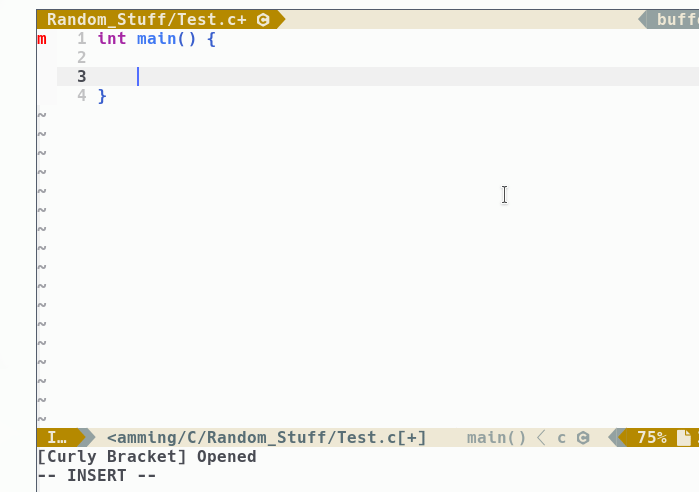

        ______   ____    _____   ______   ____     _    __    ____    __  ___
       / ____/  / __ \  / ___/  / ____/  / __ \   | |  / /   /  _/   /  |/  /
      / /      / / / /  \__ \  / /      / / / /   | | / /    / /    / /|_/ / 
     / /___   / /_/ /  ___/ / / /___   / /_/ /  _ | |/ /   _/ /    / /  / /  
     \____/   \____/  /____/  \____/   \____/  (_)|___/   /___/   /_/  /_/   

(ASCII art created with [figlet](https://github.com/cmatsuoka/figlet))

# Contributing

Thank you for considering to contribute to this project!
This README should help you to understand the structure of this project and what
you have to be aware of when contributing to this project!

# Table of contents

<!-- START doctoc generated TOC please keep comment here to allow auto update -->
<!-- DON'T EDIT THIS SECTION, INSTEAD RE-RUN doctoc TO UPDATE -->


- [Most important notes](#most-important-notes)
- [Plugin explanation](#plugin-explanation)
  - [File structure](#file-structure)
  - [Main file](#main-file)
  - [Autoload files](#autoload-files)
    - [cosco_autocmds.vim](#cosco_autocmdsvim)
    - [cosco_eval.vim](#cosco_evalvim)
  - [cosco_helpers.vim](#cosco_helpersvim)
  - [cosco_setter.vim](#cosco_settervim)
  - [cosco.vim](#coscovim)
- [Help pages](#help-pages)
- [Unittests](#unittests)
- [Debugging](#debugging)

<!-- END doctoc generated TOC please keep comment here to allow auto update -->

# Most important notes

So the important information first. If you want to contribute, please be aware
of these things:

- Explain what your code does by adding some comments. That'd be helpful for
  future changes!
- Make sure that your changes passes the unittests.

# Plugin explanation

## File structure

`cosco` has the following file structure (the "uneccessary" files aren't listed
here):

```
cosco
├── autoload
│   ├── cosco_autocmds.vim
│   ├── cosco_eval.vim
│   ├── cosco_helpers.vim
│   ├── cosco_setter.vim
│   └── cosco.vim
├── doc
│   └── cosco.txt
├── plugin
│   └── cosco.vim
└── unittests
    └── test_cosco.vim
```

## Main file

Let's start with the main file: `cosco/plugin/cosco.vim`. This file is loaded in
the beginning and sets the following up:

- the variables
- the autocommands
- the commands, which the user can use

You can take a look into it, most of it should be self-explained. The most
important part in this file, is this one:

```vim
" ====================
" 2. Autocommands
" ====================
" refresh the autocommands if the user moves to another buffer
autocmd BufEnter * call cosco_autocmds#RefreshAutocmds()
```

Ok, so it calls `cosco_autocmds#RefreshAutocmds()` everytime, when we're
entering a buffer. But where is this function?

That's the part were we are moving on to the autoload files.

## Autoload files

Little Reminder: The autoload directory consists of these files:

```
autoload
├── cosco_autocmds.vim
├── cosco_eval.vim
├── cosco_helpers.vim
├── cosco_setter.vim
└── cosco.vim
```

Here the usages of the files:

### cosco_autocmds.vim

The `cosco_autocmds#RefreshAutocmds()` is inside there. This enables for all
events, declared in the `g:cosco_auto_comma_or_semicolon_events` list, the
auto-semicolon-and-comma setter.

### cosco_eval.vim

This file is called "cosco_eval" because it "evaluates" the current "situation".
There are the conditions or "control" statements where `cosco` decides,
if a semicolon/comma should be added/removed or not even placed.
There're mainly two functions:

- `cosco_eval#Decide()`: The main lookup function
- `cosco_eval#Specials()`: Here should be all conditions, which are specifique
  for a filetype. For example in C, you can create some macros. Javascript
  doesn't have macros, so we just need to look in a C file, if the line starts
  with a `#`. This is handled there.

Ok, but how does it work? Consider the following example:

```c
    unsigned short rofl|
                       ^
                    Cursor
```

If we press the enter key, our cursor will move to the next line. **After that**
`cosco` looks, if it should add a semicolon/comma to this line or not. This is
the result:



`cosco` looks _after_ pressing the enter key because it's simpler to just type
`Return` to get to the new line and have a semicolon automatically added to the
line instead of going back to normal mode and typing `o` or something like that
in order to go to the next line.

You can go through each condition and look, how it's filtering the situation. It
might be hard to undertand at some points but I hope, that the comments explain
each condition well. Feel free to ask, if you don't understand something!

Please consider that these functions _don't_ set or remove anything! They are
just looking at the previous, next and current line to and return the given
value back what to do. For more information, take a look into the file.

## cosco_helpers.vim

This file has "only" some extra functions which are useful for the `cosco`
plugin. You can take a look into it what it has but they aren't that important.

## cosco_setter.vim

This file contains four functions, which manipulate the text inside vim. Each
of them takes one argument: The line number which has to be changed. In general
it's the line number of the previous line, since our cursor is mostly already
one line below.

So the four functions are:
- `cosco_setter#MakeSemicolon` => Add a semicolon (`;`)
- `cosco_setter#MakeComma` => Add a comma (`,`)
- `cosco_setter#MakeDoublePoints` => Add a pair of points (`:`)
- `cosco_setter#RemoveCommaOrSemicolon` => Remove the comma or the semicolon

## cosco.vim

This file contains the main-function of this plugin: `cosco#CommaOrSemiColon()`
This function does the following:

1. Load the _next_, _previous_ and the _current_ line.
2. Look, if the `cosco_eval#Specials()` function can provide a decision. If yes,
   move on to the 4. point. If not, go on to 3.
3. Go through the general conditions which are mostly in a code.
4. Now add a comma/semicolon/double point, remove it or skip the previous line.

For more information, take a look into the file.

# Help pages

Inside of the `doc/cosco.txt` there's the help page if you enter `:h cosco`.
Nothing more to say here I guess.

# Unittests

Please make sure that your changes passes the unittests when you're
contributing.

In order to run the unittests, you need to install
[this](https://github.com/h1mesuke/vim-unittest) plugin. After that you can
open the `test_cosco` file and run `:UnitTest` to run the tests.

# Debugging
You can set the `g:cosco_debugging` to 1:
```vim
let g:cosco_debugging = 1
```
which will print under your statusbar a little string like in the GIF above:
```
[Curly Bracket] Opened
```
This could help you while debugging stuff.

## Last words
Hopefully you've got a overall understanding of this plugin now! If you have
some questions, just open an issue and we'll try to help you!
