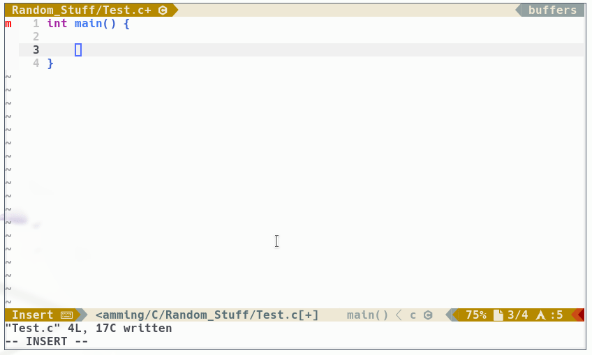

# cosco.vim

**Co**mma and **s**emi-**co**lon insertion bliss for vim.

_Cosco's official [vim.org page](http://www.vim.org/scripts/script.php?script_id=4758)_

<!-- START doctoc generated TOC please keep comment here to allow auto update -->
<!-- DON'T EDIT THIS SECTION, INSTEAD RE-RUN doctoc TO UPDATE -->
**Table of Contents**  *generated with [DocToc](https://github.com/thlorenz/doctoc)*

  - [Installation (Plugin-Manager)](#installation-plugin-manager)
- [What Cosco does:](#what-cosco-does)
- [Demo / Examples](#demo--examples)
- [Dependencies](#dependencies)
- [Usage](#usage)
  - [Using it via command](#using-it-via-command)
  - [Using it via mappings](#using-it-via-mappings)
  - [Repeating it](#repeating-it)
- [Configuration Options](#configuration-options)
  - [Tests](#tests)
  - [Known caveats](#known-caveats)
- [TODO and wish list](#todo-and-wish-list)

<!-- END doctoc generated TOC please keep comment here to allow auto update -->

## Installation (via plugin-manager)
- [Vim-Plug](https://github.com/junegunn/vim-plug):
```
Plug 'lfilho/cosco.vim', {'branch': 'stable'}
```

- [Vundle](https://github.com/VundleVim/Vundle.vim):
```
Plugin 'lfilho/cosco.vim'
```

**HINT**: Please refer to the `stable` branch if you've to write it explicit for
you plugin manager!

# What Cosco does:

Appends, substitutes or removes a comma or a semi-colon to the end of your line,
based on its context.

It:

- Takes into consideration previous and next lines endings, as well line
    indentations.
- Ignores blank lines.
- Will maintain your cursor's original position.

The best way to describe it is with examples.

# Demo / Examples

Examples (as well this plugin) were created with C in mind (but the plugin works
for any kind of file).

[](http://www.youtube.com/watch?v=xCSjdqf8sOY)

_(Click the image to watch the video)_

Another example is here with C:


The semicolon key was pressed only in the last line with the return statement.

# Dependencies

This plugin depends on [tpope/vim-repeat](https://github.com/tpope/vim-repeat)
being installed in order to have the repeat functionality.

# Usage

Cosco command won't override any mappings or commands you might already have. You have to add them yourself. (Good vim plugin writing practice!).
Here you can find two examples on how to do this. Put them on your `.vimrc`.

## Using it via command

1. Go to the target line
2. Execute the following command: `:CoscoCommaOrSemiColon`

## Using it via mappings

An example mapping, using the key combo `<Leader>;` for both `normal` and
`insert` modes:

```VimL
autocmd FileType javascript,css,YOUR_LANG nmap <silent> <Leader>; <Plug>(cosco-commaOrSemiColon)
autocmd FileType javascript,css,YOUR_LANG imap <silent> <Leader>; <c-o><Plug>(cosco-commaOrSemiColon)
```

and then you can just type `<Leader>;`.

## Repeating it

You can repeat it with `.` key as long as you have [tpope/vim-repeat](https://github.com/tpope/vim-repeat) installed.

# Configuration Options
Please open the help page for that: `:h cosco`.

## Tests

Tests are done with [vim-unittest](https://github.com/h1mesuke/vim-unittest).
Please install it, if you want to contribute.

## Known caveats

```javascript
){
    'use strict';

    var foo = 2,
        bar = null;
```

# TODO and wish list

- [X] Write plugin's vim documentation
- [ ] Write all the examples possible
- [ ] Improve test coverage
- [ ] Write mappings examples using autocommand grouping
- [ ] Write a better javascript integration, possible reading from an option .eslint and/or .jshint file (settings for comma dangling, etc)
